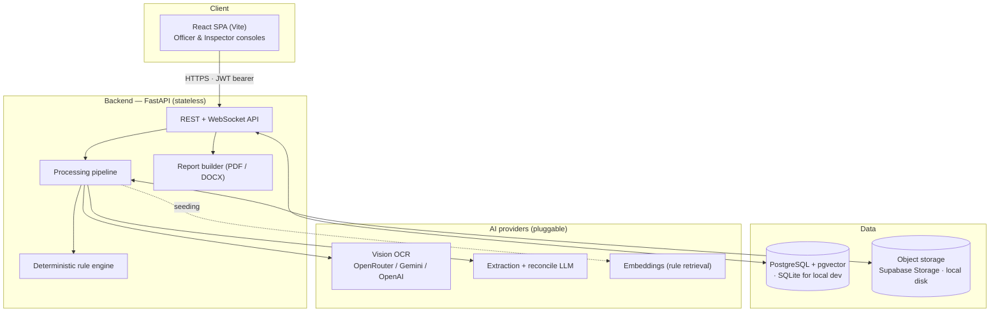
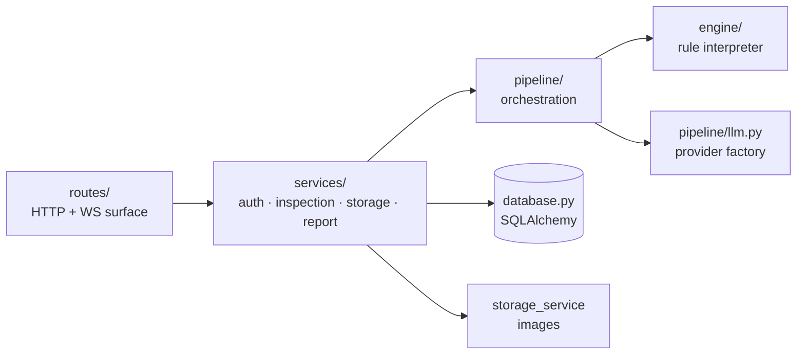
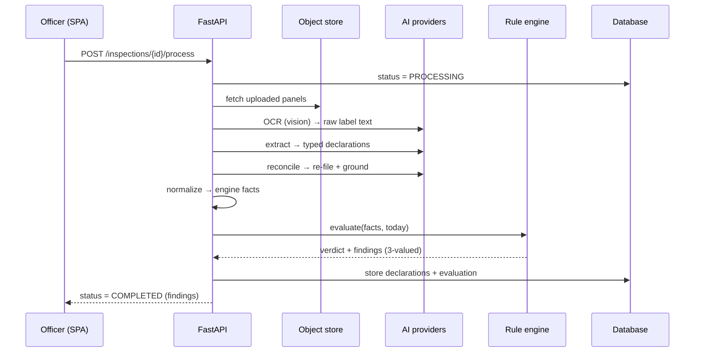
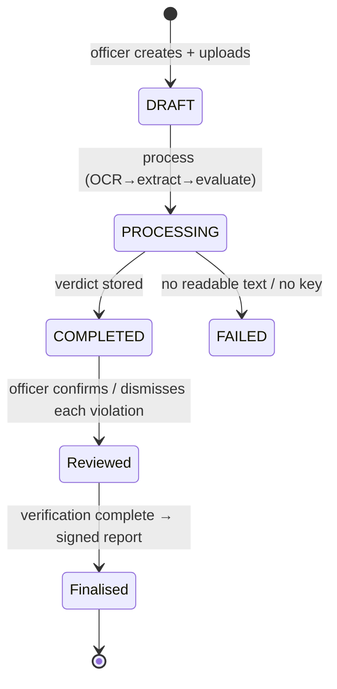
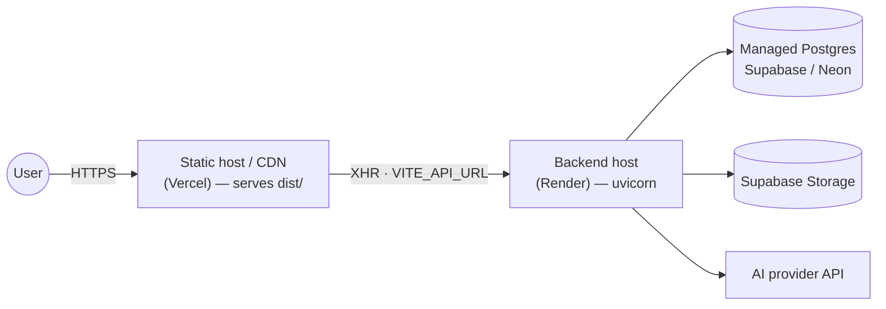

# PRISM — Technical Documentation

**Software architecture and deployment framework**

PRISM (Packaged-commodity Rule-based Inspection & Signed-report Machine) inspects photographs of a
packaged commodity against the **Legal Metrology (Packaged Commodities) Rules, 2011**. A field officer
uploads label images; the system reads the printed text, extracts the mandatory declarations, and
judges them against a deterministic rule engine. An officer then verifies the machine findings and
generates a signed compliance report; an inspector assigns cases and supervises officers.

> **Core design principle — the model never decides compliance.**
> Large language models are used only to *read* the label (OCR) and *structure* what they read
> (extraction). The pass / fail / not-verifiable verdict is produced **exclusively** by a
> deterministic, versioned rule engine. Every model output is grounded against the raw OCR text, so
> the model cannot invent a declaration that is not physically printed on the package.

---

## Table of contents

1. [System context](#1-system-context)
2. [Component architecture](#2-component-architecture)
3. [The processing pipeline](#3-the-processing-pipeline)
4. [The rule engine](#4-the-rule-engine)
5. [AI / LLM layer](#5-ai--llm-layer)
6. [Roles, workflow & lifecycle](#6-roles-workflow--lifecycle)
7. [Data model](#7-data-model)
8. [API reference](#8-api-reference)
9. [Technology stack](#9-technology-stack)
10. [Repository layout](#10-repository-layout)
11. [Configuration reference](#11-configuration-reference)
12. [Deployment framework](#12-deployment-framework)
13. [Security](#13-security)
14. [Operations & scaling](#14-operations--scaling)

---

## 1. System context

PRISM is a two-tier web application: a static single-page frontend and a stateless JSON/REST backend,
backed by a SQL database, an object store for images, and pluggable AI providers for OCR and
extraction.



The frontend holds no business logic beyond presentation and role-based routing; all authority (auth,
extraction, evaluation, report generation) lives in the backend. The two tiers deploy and scale
independently.

---

## 2. Component architecture

The backend is layered so that each concern is replaceable in isolation.



| Layer | Responsibility | Key modules |
|---|---|---|
| **routes/** | Validate requests, enforce auth, shape responses | `auth_router`, `inspection_router`, `rule_router` |
| **services/** | Business rules, authorization, persistence orchestration | `auth_service`, `inspection_service`, `storage_service`, `report/` |
| **pipeline/** | The image → verdict processing sequence | `run.py` + `preprocessing`, `extraction`, `normalization`, `compliance`, `measurement` |
| **engine/** | Pure, deterministic rule evaluation over facts | `engine.py`, `rules/*.json` |
| **infra** | DB session, config, schemas, models | `database.py`, `config.py`, `models.py`, `schemas.py` |

The engine has **no dependency** on the web layer, the database, or any AI provider — it is a pure
function `run(facts, on_date) → report`, which makes it unit-testable in isolation and auditable by a
regulator.

---

## 3. The processing pipeline

`POST /inspections/{id}/process` runs the whole pipeline **synchronously** in
[`pipeline/run.py`](Backend/pipeline/run.py) and streams stage-by-stage progress over a WebSocket
(`/inspections/{id}/progress`).



| Stage | Module | What it does |
|---|---|---|
| **Preprocess** | `preprocessing/images.py` | Decode, blur-reject, resize to the long-edge limit (`MAX_IMAGE_EDGE`, default **1280 px**), JPEG re-encode |
| **OCR** | `extraction/ocr.py` | Reads the label to raw text. Default backend is a **vision LLM** (`OCR_BACKEND=openrouter`); an optional local **PaddleOCR** backend (`OCR_BACKEND=paddle`) additionally returns per-word bounding boxes |
| **Extract** | `extraction/declarations.py` | LLM pulls the OCR text into a typed `PackageDeclarations` schema (24 declaration fields, each with a confidence) |
| **Reconcile** | `extraction/inference.py` | A second LLM pass re-files values into the correct fields and repairs OCR damage; every free-text value is **grounded** against the OCR by fuzzy substring match (`INFERENCE_MIN_SIMILARITY`) so nothing is invented |
| **Normalize** | `normalization/declarations.py` | Flattens declarations to dotted engine **fact paths** (e.g. `net_quantity.value`) and derives context facts (imported vs domestic, physical state, languages) |
| **Evaluate** | `compliance/evaluate.py` + `engine/` | The deterministic rule engine produces the verdict and per-rule findings |
| **Measure** | `measurement/` | *(PaddleOCR backend only)* ArUco reference marker → physical scale → Rule 7 character height in mm |

**No API key configured?** OCR and extraction both require a model. With `LLM_API_KEY` blank the app
starts and every non-AI screen works, but `process` returns a clearly-marked development fallback
(`extractor_tag → fallback:dev:*`) rather than a real reading — see [§5](#5-ai--llm-layer).

---

## 4. The rule engine

[`engine/engine.py`](Backend/engine/engine.py) interprets a versioned rule set
([`engine/rules/lmpc_2011_rules.json`](Backend/engine/rules/lmpc_2011_rules.json) — **63 rules**,
`rule_set_version: 2026.09-draft1`) using **three-valued logic**: `TRUE` / `FALSE` / `UNKNOWN`.

Each rule declares:

| Field | Meaning |
|---|---|
| `applies_when` | Predicate deciding whether the rule is in force for this package (else `NOT_APPLICABLE`) |
| `exempt_when` | Predicate for a statutory exemption (else evaluated; e.g. small-sachet exemptions) |
| `check` | The requirement itself — numeric threshold, format/wording, or presence |
| `verification_mode` | Whether the requirement is decidable from a photograph, or needs physical measurement / a registry lookup |
| `severity` | `CRITICAL` / `HIGH` / `MEDIUM` / `LOW` / `INFO`, used to derive case priority |

A requirement that **cannot be established from a photograph** (font height, net-quantity error, lot
sampling, registration) is returned `REQUIRES_VERIFICATION` / `NOT_VERIFIABLE` — **never** silently
marked compliant. Numeric checks derive a canonical `base_value` from the parsed value and unit;
format and wording checks read the declaration text. The output for a typical retail package: a
single verdict (`COMPLIANT` / `NON_COMPLIANT` / `REQUIRES_VERIFICATION` / `EXEMPT`), counts, and a
list of findings each carrying the provision reference, observed value, severity and a plain-language
explanation. An `adjudicate` cross-check can withdraw a violation that a later signal clears.

Because the engine is a pure function of `(facts, date)`, the same package always yields the same
verdict, and upgrading the law is a **data change** (a new rules JSON + `RULE_SET_VERSION`), not a
code change. The rule-set version is pinned onto each inspection at creation for auditability.

---

## 5. AI / LLM layer

[`pipeline/llm.py`](Backend/pipeline/llm.py) is a **provider-agnostic factory**. Providers are chosen
by environment variable, so swapping models is a `.env` change, not a code change.

| Step | Uses | Default provider |
|---|---|---|
| Vision OCR | chat model with image input | `LLM_PROVIDER` (`google` Gemini by default; `openrouter` / `openai` supported) |
| Extraction | structured output (`json_schema`) | `LLM_PROVIDER` / `LLM_MODEL` |
| Reconcile | structured output | `INFERENCE_PROVIDER` (falls back to `LLM_PROVIDER`) |
| Rule-passage embeddings | embedding model | Google (`EMBEDDING_MODEL`), used only by `seed_provisions.py` |

Two common configurations:

- **Google Gemini** (`.env.example` default): `LLM_PROVIDER=google`, `LLM_MODEL=gemini-2.0-flash` —
  one key does OCR + extraction + embeddings.
- **OpenRouter**: `LLM_PROVIDER=openrouter`, `LLM_BASE_URL=https://openrouter.ai/api/v1`,
  `LLM_MODEL=openai/gpt-4o-mini` — lets the reconcile pass run on a different model from extraction.

All structured calls use retry-on-empty. **Grounding** (fuzzy substring match against the OCR text)
is what prevents hallucinated declarations; derived numeric fields (a parsed quantity or date) skip
the substring gate but are still range-checked.

---

## 6. Roles, workflow & lifecycle

Two roles drive a Kanban workflow. Case **stage** advances through
`ASSIGNED → IN_PROGRESS → ACTION_REQUIRED → RESOLVED`; case **status** tracks processing
(`DRAFT → PROCESSING → COMPLETED / FAILED`).

| Role | Can do |
|---|---|
| **OFFICER** (field) | Create inspections, capture/upload panels, run processing, move own cards, review each violation, finalise verification, download the signed report |
| **INSPECTOR** (supervisor) | See **every** case, assign cases to officers, view any officer's board read-only, review findings, finalise |



Authorization: an officer sees only cases they own or are assigned; an inspector sees all. Only an
inspector may `assign`. Only the owning/assigned officer may move a card. A report can be built only
after verification is finalised.

---

## 7. Data model

Tables are created on startup via `Base.metadata.create_all` (SQLAlchemy 2.0). On Postgres, pgvector
is enabled for the embedding column; on SQLite (local dev) the embedding degrades to a JSON column.

| Table | Holds |
|---|---|
| `users` | id, username, bcrypt password hash, full name, `role` |
| `inspections` | reference, owner, `assigned_to`, `status`, `stage`, verification state, rule-set version |
| `inspection_images` | storage path, original filename, display order |
| `ocr_texts` | raw OCR text per image panel |
| `declarations` | one row per extracted field: fact path, value, confidence |
| `evaluations` | verdict + the full engine result as one JSON column |
| `finding_reviews` | officer decision (`CONFIRMED` / `DISMISSED` / …) + note, per rule |
| `font_measurements` | measured height, scale, status per declaration (Rule 7) |
| `rule_passages` | rule text + `vector(3072)` embedding for retrieval-augmented report justification |

Access tokens are JWT bearer tokens valid 12 hours; there is no refresh token.

---

## 8. API reference

Base URL = the backend origin. All routes except health/auth require `Authorization: Bearer <token>`.

### Auth
| Method | Path | Purpose |
|---|---|---|
| `POST` | `/auth/register` | Create a user (`username`, `password`, `confirmPassword`, `full_name`, `role`) |
| `POST` | `/auth/login` | OAuth2 password form → `{ access_token }` |
| `GET` | `/auth/me` | Current user |

### Inspections
| Method | Path | Purpose |
|---|---|---|
| `POST` | `/inspections` | Create an inspection |
| `GET` | `/inspections?scope=mine\|all&officer_id=&q=` | List (scope/role-aware, searchable) |
| `GET` | `/inspections/{id}` | Full detail (images, OCR, declarations, evaluation, reviews) |
| `POST` | `/inspections/{id}/images` | Upload one or more panel images |
| `DELETE` | `/inspections/{id}/images/{imageId}` | Remove an image |
| `GET` | `/inspections/{id}/images/{imageId}/file` | Fetch image bytes |
| `POST` | `/inspections/{id}/process` | Run the pipeline (OCR → extract → evaluate) |
| `WS` | `/inspections/{id}/progress?token=` | Live stage progress |
| `PATCH` | `/inspections/{id}/assign` | *(inspector)* assign to an officer |
| `PATCH` | `/inspections/{id}/card` | Move stage / edit note |
| `PUT` | `/inspections/{id}/findings/{ruleId}` | Confirm / dismiss a finding |
| `PUT` | `/inspections/{id}/declarations` | Correct declarations and re-evaluate |
| `PATCH` | `/inspections/{id}/finalize` | Finalise verification |
| `GET` | `/inspections/{id}/report?format=pdf\|docx` | Download the signed report |
| `GET` | `/inspections/officers/list` | *(inspector)* officers for assignment |

### Rules & health
| Method | Path | Purpose |
|---|---|---|
| `GET` | `/rules` | The versioned rule catalogue |
| `GET` | `/health` | Liveness + effective LLM/OCR/storage config |

---

## 9. Technology stack

| Layer | Technology |
|---|---|
| Frontend | React 19 + TypeScript, Vite, React Query, React Router, plain CSS (light/dark tokens) |
| Backend | FastAPI, Pydantic v2, SQLAlchemy 2.0, Uvicorn |
| Database | PostgreSQL + pgvector (Supabase / Neon); SQLite for local dev |
| Object storage | Supabase Storage via REST (httpx); local-disk fallback |
| OCR | Vision LLM (default) or PaddleOCR + paddlepaddle (optional, local CPU) |
| Vision (Rule 7) | OpenCV / opencv-contrib (ArUco, character segmentation) |
| LLM orchestration | LangChain (`langchain-google-genai`, `langchain-openai`) |
| Auth | JWT bearer (python-jose), bcrypt hashing (passlib) |
| Reports | reportlab (PDF), python-docx (DOCX), pypdfium2 (rulebook rendering) |

---

## 10. Repository layout

> **Note:** the top-level app folders are `Backend/` and `Frontend/` (capitalised). On case-sensitive
> hosts (Linux/Render/Vercel) the deploy config's `rootDir` must match this case exactly.

```
Backend/
  main.py  database.py  models.py  schemas.py  config.py
  seed_provisions.py                  OCRs the rulebook into rule_passages (RAG)
  seed_demo.py                        seeds demo users + inspections for a showcase
  routes/       auth_router.py  inspection_router.py  rule_router.py
  services/     auth_service.py  inspection_service.py  storage_service.py
                report/           build.py (PDF/DOCX) · justify.py · rules_context.py
  pipeline/
    run.py                            the sequential pipeline
    llm.py                            provider-agnostic model + embedding factory
    progress.py                       WebSocket progress hub
    preprocessing/images.py           decode, resize, blur check, JPEG encode
    extraction/ocr.py                 vision OCR (default) / PaddleOCR (optional)
    extraction/declarations.py        LLM structured extraction (typed schema)
    extraction/inference.py           second-pass reconciliation, grounded
    extraction/patterns.py            regex backfill for numbers/dates
    normalization/declarations.py     declarations → engine facts
    compliance/evaluate.py            runs the engine, shapes findings
    compliance/adjudicate.py          cross-check that can clear a violation
    measurement/reference.py          ArUco scale
    measurement/font.py               character height + Rule 7 check
  engine/
    engine.py                         deterministic rule interpreter
    rules/lmpc_2011_rules.json        63 versioned rules
    rules/reference_tables.json       Rule 7 tables, unit tables
    samples/                          golden facts for engine tests
  requirements.txt                    default deploy (no native OCR deps)
  requirements-ocr-paddle.txt         optional PaddleOCR + OpenCV extras
Frontend/
  src/
    pages/        OfficerDashboard · OfficerBoard · OfficerCapture ·
                  InspectorRepository · InspectorBoard · Inspection · Rules · History · auth
    components/   KanbanBoard · EvaluationView · FindingReview · DeclarationList ·
                  CameraCapture · Donut/BarChart · StatusBadge · Toast · …
    layouts/      RootLayout · ProtectedRoute · RoleRoute
    hooks/        useUser · useInspection · useProgress · useTheme
    apis/api.ts   axios client (JWT interceptor, 401 → sign-in)
  vercel.json     SPA rewrite (all routes → index.html)
render.yaml       backend service definition (Render)
```

---

## 11. Configuration reference

All backend configuration is environment-driven ([`config.py`](Backend/config.py)); defaults suit a
zero-config local run.

| Variable | Default | Purpose |
|---|---|---|
| `DATABASE_URL` | `sqlite:///./data/app-<branch>.db` | DB connection; `postgres[ql]://…` is auto-upgraded to `postgresql+psycopg://` |
| `JWT_SECRET_KEY` | `change-me-in-production` | Signs access tokens — **must** be set in production |
| `LLM_PROVIDER` / `LLM_API_KEY` / `LLM_MODEL` | `google` / *(blank)* / `gemini-2.0-flash` | OCR + extraction model; blank key → dev fallback |
| `LLM_BASE_URL` | OpenRouter URL | Base URL when `LLM_PROVIDER=openrouter` |
| `INFERENCE_ENABLED` / `INFERENCE_PROVIDER` / `INFERENCE_API_KEY` / `INFERENCE_MODEL` | `true` / *(=LLM)* | Reconcile-pass model (may differ from extraction) |
| `EMBEDDING_MODEL` / `EMBEDDING_DIM` / `GOOGLE_EMBED_KEY` | Gemini / `3072` | Rule-passage embeddings (seeding only) |
| `OCR_BACKEND` | `openrouter` | `openrouter` (vision LLM) or `paddle` (local; enables word boxes + Rule 7) |
| `OCR_LANG` | `en` | PaddleOCR language (`en`, `devanagari`, …) |
| `MAX_IMAGE_EDGE` | `1280` | Long-edge resize before OCR |
| `SUPABASE_URL` / `SUPABASE_KEY` / `SUPABASE_BUCKET` | *(blank)* | Image storage; blank ⇒ local disk under `./uploads` |
| `RULE_SET_VERSION` | `2026.09-draft1` | Version pinned onto new inspections |
| `ALLOWED_ORIGINS` | `http://localhost:5173` | Comma-separated CORS origins (the frontend URL) |
| `BLUR_MIN_VARIANCE` / `BLUR_SAMPLE_EDGE` | `80` / `640` | Blur-rejection threshold |

Frontend: `VITE_API_URL` (baked in at build time) must point at the deployed backend.

---

## 12. Deployment framework

The two apps deploy **independently**: a stateless Python backend on any Linux host, and a static
frontend on any CDN/static host. Reference configs ship in the repo — `render.yaml` (backend) and
`Frontend/vercel.json` (frontend SPA rewrite).



### 12.1 Backend

Requires **Python 3.12** — it is pinned by `runtime.txt` / `.python-version`, and several pinned
dependencies (numpy 1.26, and the optional paddlepaddle) publish no wheels for 3.13+.

```bash
# from inside Backend/
python3.12 -m venv .venv
.venv/bin/pip install -r requirements.txt          # + requirements-ocr-paddle.txt for local OCR
.venv/bin/python -m uvicorn main:app --host 0.0.0.0 --port $PORT --workers 1
```

Tables are created on startup; no migration step. Set every secret through the host environment
(never in the repo). Keep `--workers` low if you use the PaddleOCR backend — each worker loads the
OCR model, and PaddleOCR downloads ~16 MB into a writable cache (`~/.paddleocr`) on first use, so
give the host a persistent filesystem and warm it with one request after deploy.

`render.yaml` (adjust `rootDir` to the real folder case, `Backend`):

```yaml
services:
  - type: web
    name: prism-backend
    runtime: python
    rootDir: Backend
    buildCommand: pip install -r requirements.txt
    startCommand: python -m uvicorn main:app --host 0.0.0.0 --port $PORT
    envVars:
      - key: PYTHON_VERSION
        value: "3.12.10"
```

### 12.2 Frontend

```bash
# from inside Frontend/
echo 'VITE_API_URL="https://your-backend-domain"' > .env.production
npm ci && npm run build           # → dist/
```

Deploy `dist/` as static files. `vercel.json` already rewrites all routes to `index.html` so the SPA
handles client-side routing.

### 12.3 Order of operations

1. Provision Postgres (enable the `vector` extension) and, optionally, a Supabase storage bucket.
2. Deploy the backend with all secrets set; note its public URL. Optionally run
   `python seed_provisions.py` once to populate rule-passage embeddings for report justification.
3. Set `ALLOWED_ORIGINS` on the backend to the frontend URL and restart.
4. Build the frontend with `VITE_API_URL` = the backend URL and deploy `dist/`.

---

## 13. Security

- **Secrets** live only in the host environment; `.env` is gitignored. Rotate any key ever shared in
  plaintext.
- **Auth** is a 12-hour JWT bearer token, signed with `JWT_SECRET_KEY` (HS256). Passwords are bcrypt
  hashed. The SPA stores the token in `localStorage`; a `401` clears it and returns to sign-in.
- **Authorization** is enforced server-side per request (role + ownership checks in
  `inspection_service`), never trusted from the client.
- **CORS** is an explicit allow-list (`ALLOWED_ORIGINS`).
- **No PII in URLs**; images are fetched through an authenticated endpoint, not public links (unless a
  public Supabase bucket is deliberately configured).
- **Auditability**: the rule-set version is pinned per inspection, the original machine value is kept
  alongside every officer correction, and the verdict is reproducible from stored facts.

---

## 14. Operations & scaling

- **Statelessness**: the backend keeps no session state, so it scales horizontally behind a load
  balancer. State lives in Postgres and object storage.
- **Processing cost**: `process` is synchronous and dominated by the AI round-trips (OCR + extraction
  + reconcile). For high throughput, move it to a background worker/queue and let the existing
  WebSocket progress channel report completion.
- **Health**: `GET /health` reports the effective LLM model, OCR backend, and storage mode — use it as
  the readiness probe.
- **Rule updates**: ship a new `lmpc_2011_rules.json` + bump `RULE_SET_VERSION`; existing inspections
  keep the version they were judged under.
- **Testing**: `engine/` and the pipeline ship with golden-sample tests (`engine/samples/`,
  `test_engine.py`, `pipeline/test_extraction.py`) — the engine is deterministic and testable without
  any AI provider.
